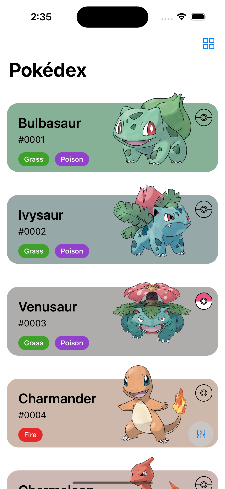
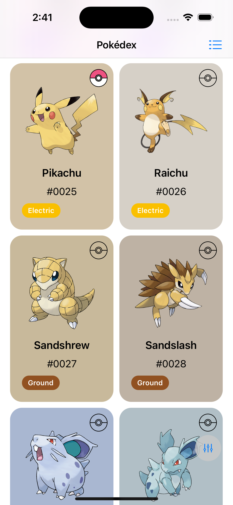
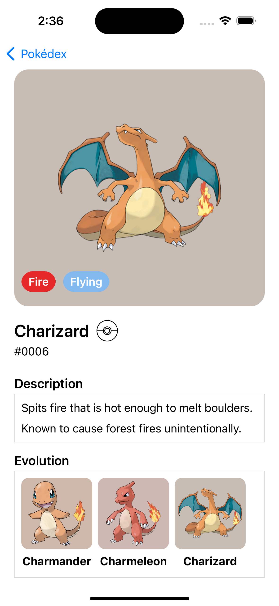
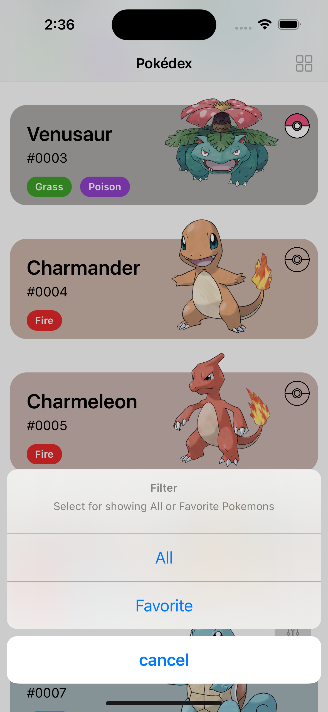

# Pokédex

### 畫面截圖(Screenshot)

<div style="display: flex; align-items: center;">
	
	
	
	
</div>

### 安裝步驟

切換到Pokedex目錄下執行```pod install --repo-update```

### 使用到的第三方工具

- Alamofire
- SDWebImage
- Snapkit

### 專案說明

Pokédex採用了簡潔明亮的卡片設計來襯托活靈活現的寶可夢們，每張卡片的底色使用了該寶可夢的平均色，跟寶可夢搭配起來既不會搶了主角的光環更可以帶來舒適的視覺效果。

我自已則特別喜歡List的設計，感覺寶可夢特別生動。

#### Pokédex包含了以下功能：
- 寶可夢列表：點擊主畫面右下角的filter按鈕進行切換
- 最愛寶可夢列表：點擊主畫面右下角的filter按鈕進行切換
- 各屬性寶可夢列表：點擊卡片上的屬性可以進入該屬性寶可夢的列表
- Grid/List切換：點擊右上角的按鈕切換
- 收藏功能：在各個列表及detail頁都可以進行寶可夢的收藏
- 進化鏈：detail頁提供該寶可夢的進化鏈
- Auto loading：隨著滾動到畫面的底部，會自動拉取下一頁的資料

#### 架構及實作說明

架構使用了MVVM，讓bussiness logic及畫面的程式碼分開，讓程式可以更乾淨並提高可測試性。

同時我也將API層獨立出來並建立API Router，好處是可以有效的管理各個api及快速的建立mock data。

而在API層的NetworkManager中也加入了簡單的快取機制，會將API在一個小內以raw json儲存在Local的File，以避免重覆呼叫同樣的API資源。

而在寶可夢的收藏方面，我則挑選了最快速的userDefault來儲存，不為其他的原因，就只是為了快速而已。

而在開發的過程中，發現會需要從URL中提取各種ID，於是便Tools中建立了func getPokeID()，來重覆利用，也透過Unittest來驗證該function的可靠性。


-----

### Installation Steps

Run pod install --repo-update in the Pokedex director

### Third-Party Tools Used

	•	Alamofire
	•	SDWebImage
	•	Snapkit

### Project Description

Pokédex uses a clean and bright card design to showcase the lively Pokémon. Each card’s background color is based on the average color of the Pokémon, which complements the Pokémon without overshadowing it, providing a comfortable visual effect and made pokemons more vibrant.

### Features of Pokédex

- Pokémon List: Click the filter button at the bottom right of the main screen to switch.
- Favorite Pokémon List: Click the filter button at the bottom right of the main screen to switch.
- Pokémon List by Type: Click on the type on the card to enter the list of Pokémon of that type.
- Grid/List Switch: Click the button at the top right to switch.
- Favorite Function: You can favorite Pokémon in each list and detail page.
- Evolution Chain: The detail page provides the evolution chain of the Pokémon.
- Auto Loading: When scrolling to the bottom of the screen, the next page of data will be automatically fetched.

### Architecture and Implementation

The architecture uses MVVM to separate business logic and UI code, making the code cleaner and more testable.

I also separated the API layer and created an API Router, which helps manage various APIs effectively and quickly create mock data.

In the NetworkManager of the API layer, I added a simple caching mechanism that stores the raw JSON of the API locally for a short period to avoid redundant API calls.

For favoriting Pokémon, I chose to use the fastest userDefault for storage, simply for the sake of speed.

During development, I found a need to extract various IDs from URLs, so I created a func getPokeID() in the Tools for repeated use, and verified its reliability through Unittest.